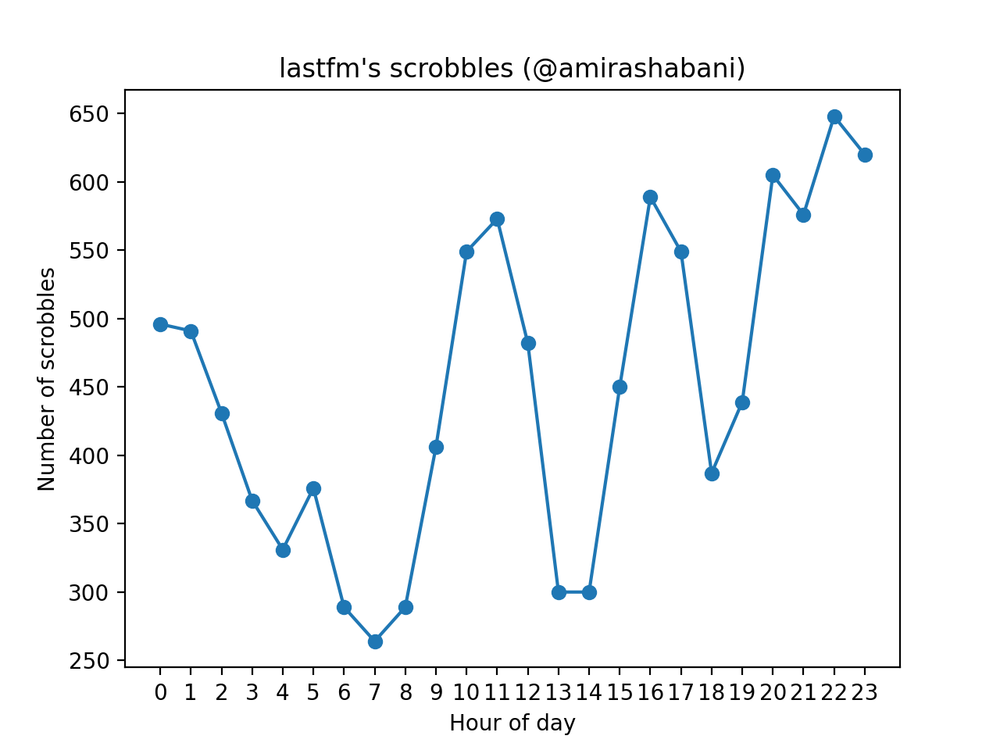

# LastFM Scrobbles



In order to get the same chart as above, clone this repository:

```bash
git clone https://github.com/amirashabani/lastfm
cd lastfm
```

Go to https://benjaminbenben.com/lastfm-to-csv, download the CSV file into the directory of this repository, install the libraries and run the code on that file (here `amirashabani.csv`):

```bash
python -m venv venv
source venv/bin/activate
pip install -r requirements.txt
python hour.py amirashabani.csv
```
